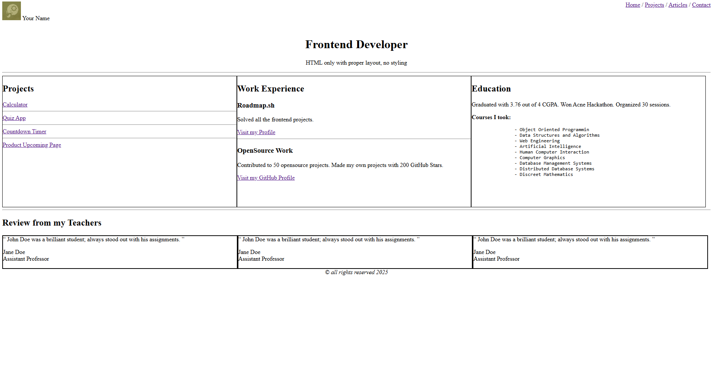

# Basic HTML Website Project from Roadmap.sh

<b>Project description:</b> <a href="https://roadmap.sh/projects/basic-html-website">Basic HTML Website</a>

<section>
    <h2>Result</h2>
    
</section>